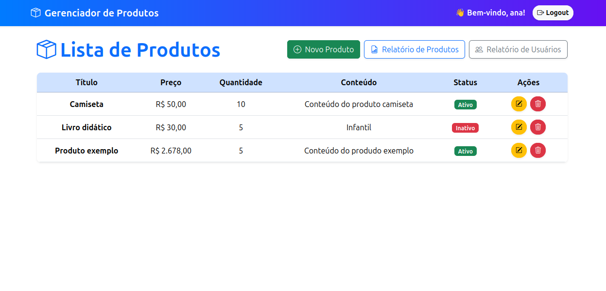
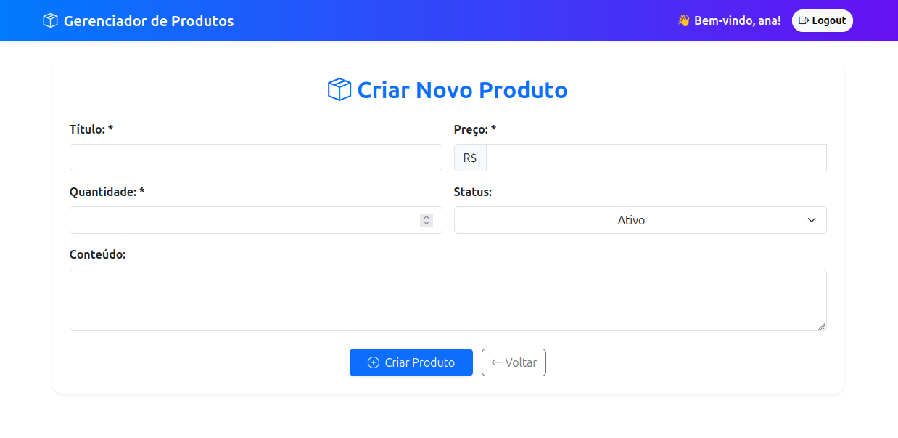
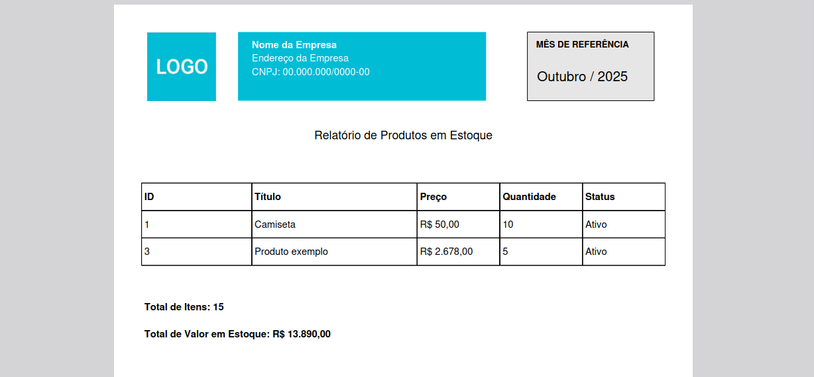

## 📷 Capturas de Tela

**Tela de Listagem de Produtos**  


**Formulário de Cadastro/Atualização**  


**Relatório em PDF**  


#  Gerenciador de Produtos - Laravel

Aplicação web de gerenciamento de produtos, com cadastro de usuários, autenticação, CRUD de produtos, relatórios em PDF.


## Funcionalidades

- Registro e login de usuários.
- CRUD completo de produtos (criar, listar, editar, excluir).
- Geração de relatórios em PDF:
  - Lista de produtos em estoque (com total de valor e quantidade).
  - Lista de usuários cadastrados.
- Frontend responsivo com Bootstrap 5.
- Validação de dados nos formulários.
- Autenticação Laravel Sanctum.

## Requisitos

- PHP >= 8.1 
- Extensões PHP: `mbstring`, `xml`, `bcmath`, `curl`, `zip`, `gd`, `intl`, `mysql`, `sqlite3`
- Composer 
- MySQL ou PostgreSQL
- Laravel >= 9.x


## Instalação

1. **Clone o repositório:**

```bash
 git clone https://github.com/hannagabyy/gerenciador-produtos.git
 cd gerenciador-produtos
```
2. **Instale as dependências PHP com Composer:**  
- Instale as dependências necessárias do php
```bash
sudo apt update && sudo apt install -y \
php8.3-cli php8.3-common php8.3-mbstring php8.3-xml php8.3-bcmath php8.3-curl \
php8.3-zip php8.3-gd php8.3-intl php8.3-mysql php8.3-sqlite3 php8.3-tokenizer \
php8.3-fileinfo php8.3-bz2 php8.3-opcache php8.3

```

```bash
 composer install
 npm install
```
3. **Copie o arquivo de ambiente:**  
```bash
 cp .env.example .env
```

 - **Configure as variáveis de ambiente no arquivo .env**  
```bash
    DB_CONNECTION=mysql
    DB_HOST=127.0.0.1
    DB_PORT=3306
    DB_DATABASE=produtos_db
    DB_USERNAME=usuario
    DB_PASSWORD=senha

```
- Configure a chave da aplicação
```bash
php artisan key:generate
```
4. **Execute as migrações:**
```bash
php artisan migrate --seed
```

5. **Execute o servidor**
```bash
php artisan serve
````
-Teste o usuário teste email: 'admin@gmail.com' senha: '12345678' ou crie um novo usuário.
